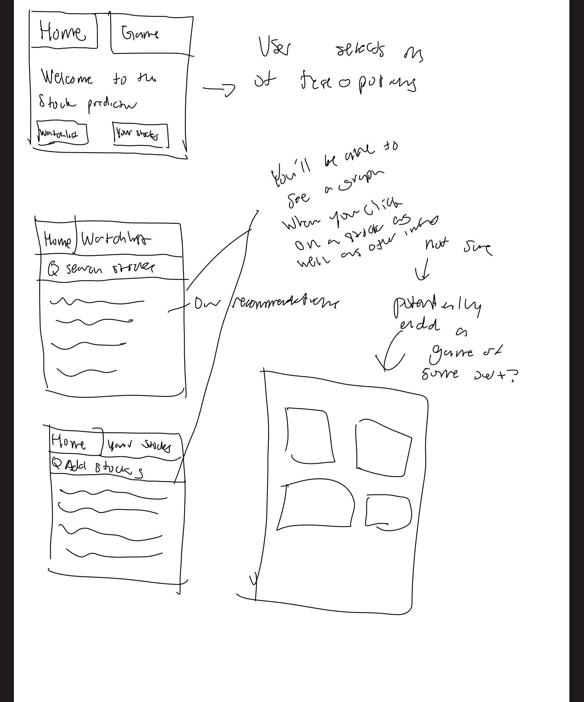

:warning: Everything between << >> needs to be replaced (remove << >> after replacing)

# << Project Title >>
## CS110 Final Project Fall, 2024

## Team Members
Giankyle Vallarta 
Gaven Chan 
***

## Project Description
This game will be a stock predictor where it incorporates where it provides you a list and advice for future stock trends and where to put your money in.

***    

## GUI Design

### Initial Design

### Final Design

## Program Design

### Features

1. Home Gui
2. Predicts stock over period of time 
3. Saved stocks for future references
4. Buttons for each stock that was inputted
5. Top stocks of each da 

### Classes

- << You should have a list of each of your classes with a description >>

## ATP

| Step                 |Procedure             |Expected Results                   |
|----------------------|:--------------------:|----------------------------------:|
|  1                   |Go to Your Stocks and press the button| Text box will appear on display |
|  2                   |Type your desired stock, in this case do NVDA, then press enter| Display will show "Valid Stock!" and ask forecast days|
|  3                   |Input 100 days and then press enter| Graph of NVDA will appear.|
|  4                   |Close the Graph window and press home| Graph will disappear, user will go to homepage |
|  5                   |Press the Watchlist button| NVDA(100) button will appear       |
|  6                   |Click the NVDA(100) button  | The graph will reappear of NVDA       |
|  7                   |Close the graph window and press home    |User will be brought back to the home page |
